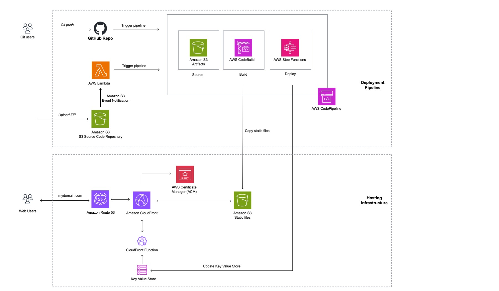
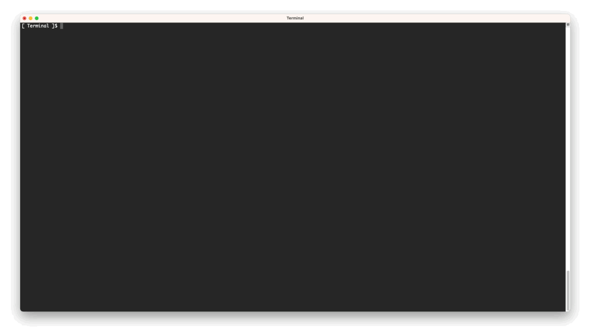

# CloudFront Hosting Toolkit

CloudFront Hosting Toolkit, an open source command line tool to help developers deploy fast and secure frontends in the cloud. 

## Self-managed Frontend Hosting on AWS

CloudFront Hosting Toolkit offers the convenience of a managed frontend hosting service while retaining full control over the hosting and deployment infrastructure to make it your own.


Effortlessly deploy and manage your frontend with the CloudFront Hosting Toolkit CLI. A quick installation, two commands, and the CLI automatically establishes a deployment pipeline and infrastructure, ensuring seamless updates after each Git push. Maintain full control over your cloud resources for flexibility, enabling modifications at any time. This eliminates the need for time-consuming setup, empowering you to swiftly customize and deploy well-architected frontends within your existing Git workflow.

The CLI simplifies AWS platform interaction for deploying static websites. It walks you through configuring a new repository, executing the deployment process, and provides the domain name upon completion. By following these steps, you effortlessly link your GitHub repository and deploy the necessary infrastructure, simplifying the deployment process. This enables you to focus on developing website content without dealing with the intricacies of infrastructure management.

CloudFront Hosting Toolkit provides flexibility in how it can be used:

- **CLI**: Use the Command-Line Interface (CLI) for a straightforward, step-by-step deployment process.
- **CDK Construct**: Leverage the CloudFront Hosting Toolkit, a ready-made L3 CDK construct, for seamless integration into your AWS projects.
- **CDK source code**: Adjust the CDK source code to tailor the infrastructure according to your requirements.

## Features


- **Self-paced wizard for easy setup**: Our self-paced setup wizard guides you through the installation process step by step, making it effortless to get started with our project.

- **Instant deployment for quick results**: Experience rapid deployment of your project changes, reducing waiting times and accelerating your development cycle. The solution automatically clears the cache of the previous version.

- **Seamless GitHub integration for version control**: Integrate your project seamlessly with GitHub, enabling efficient version control and collaboration with your team.

- **Optimized caching for improved performance**: We've implemented advanced caching mechanisms to enhance your project's performance, ensuring faster response times and reduced server load.

- **Enhanced security headers for protection**: Your project benefits from enhanced security headers to safeguard against potential security vulnerabilities, helping protect your users and data.

- **Custom domain name support with TLS certificate**: Easily configure custom domain names for your project and secure them with TLS certificates, ensuring a professional and secure online presence.


## Table of Contents

- [Architecture](#architecture)
- [Getting Started with the CLI](#getting-started-with-the-cli)
- [Getting Started with CDK](#getting-started-with-cdk)
- [Advanced Usage](#advanced-usage)
- [Troubleshooting](#troubleshooting-guide)
- [Roadmap](#roadmap)
- [Requirements](#requirements)
- [FAQ](#faq)
- [Contributing Guidelines](#Contribute)
- [License](#license)


## Architecture



Whenever new code changes are pushed to the corresponding GitHub repository (or alternatively a ZIP file to an S3 bucket in the S3 based workflow), the project automatically triggers an AWS CodePipeline. In the build step, tasks including code compilation and creating deployment artifacts are executed according to the detected web framework in the initialization step of the CLI. The output deployment artifacts are then uploaded to hosting S3 bucket, under a new folder identified by the commit ID. In the deploy step, a Step Function orchestrates an update to the KeyValueStore to instruct the CloudFront Function to route traffic to the newly created folder while bypassing the cached content of the previous frontend version. 

Whether you're working with a GitHub source code repository or an S3 source code repository—the process of managing your project's code and deployment follows a similar pattern with some distinctions:

GitHub Source Code Repository:

1. Source stage: Whenever new code changes are pushed to the corresponding GitHub repository, the project automatically triggers an AWS CodePipeline.

2. Build stage: Within the pipeline's Build stage, known as the build step, a buildspec YAML is employed to construct the project. This build process may include tasks like compiling code, running tests, and creating deployment artifacts. After the build is complete, all the resulting source files are then transferred to a hosting S3 bucket, creating a new folder identified by the commit ID.

3. Deploy stage: The third phase entails a Step Function responsible for updating the Key-Value Store by associating the commit ID with the corresponding folder name in the S3 storage. The primary role of the Cloudfront function is to reroute all incoming requests to the newly created folder.

S3 Source Code Repository Configuration:

1. Source stage: Uploading a ZIP file to an S3 bucket automatically triggers an AWS CodePipeline within the project.

2. Build stage: In the case of S3 source code repositories, there is no build involved. Instead, the ZIP file is copied directly from the source S3 bucket, unzipped, and its files are then copied to the hosting S3 bucket creating a new folder identified by the commit ID.

3. Deploy stage: Similar to the GitHub scenario, a Step Function is responsible for updating the Key-Value Store by associating the commit ID with the corresponding folder name in the S3 storage. The Cloudfront function's primary function is to redirect all incoming requests to the newly created folder. 

Once the initial deployment is complete, you can simply focus on working on your website, as no other actions are required.


### ⚠️ Important

> Before you get started, ensure that your AWS credentials are properly configured. Additionally, make sure you have the AWS CLI installed and configured to connect to the AWS account where you intend to deploy the hosting infrastructure and your GitHub repository ready. If you're deploying from an S3 bucket, ensure you have your website's static files ready to be uploaded.


## Getting Started with the CLI
To start using CloudFront Hosting Toolkit CLI, you need to install the CLI tool. Ensure you have Node.js 18+ installed on your machine. If you don't have Node.js, you can download it [here](https://nodejs.org/en/download/).

Once Node.js is installed, run the following command to install CloudFront Hosting Toolkit globally:


### Installation

To download and install the CLI, run the following command:

```bash
  npm install -g @aws/cloudfront-hosting-toolkit
```

CloudFront Hosting Toolkit offers deployment flexibility: If you already have the repo cloned, follow the 1st option for automatic detection of GitHub repo details. Alternatively, you may follow the second option if you don't have it or prefer manual input.

##### Option 1: Automatic Configuration and Deployment


CloudFront Hosting Toolkit CLI simplifies the deployment process by automatically detecting required information when run in a folder where your static GitHub repository is cloned. 

Navigate to the folder where your static GitHub repository is cloned:

```bash
cd /path/to/your/repo
```

Initialize your deployment configuration:

```bash
cloudfront-hosting-toolkit init
```

CloudFront Hosting Toolkit CLI will detect the required information, such as your GitHub repository details, and guide you through the setup process. However, you also have the flexibility to manually override these detected details if needed.

The animated GIF below demonstrates the initialization process


Deploy your website:

```bash
cloudfront-hosting-toolkit deploy
```


The animated GIF below demonstrates the deployment process


##### Option 2: Manual Configuration and Deployment

If you prefer to run CloudFront Hosting Toolkit CLI in a different folder or need to manually provide the required information, follow these steps:

Navigate to the folder where you want to run CloudFront Hosting Toolkit:

```bash
cd /path/to/your/preferred/folder
```

Initialize your deployment configuration:

```bash
cloudfront-hosting-toolkit init
```

Follow the prompts to configure your deployment, including specifying your GitHub repository details or providing other necessary information.

Deploy your website:

```bash
cloudfront-hosting-toolkit deploy
```


### Example Commands

Here are some common commands to help you get started with CloudFront Hosting Toolkit:

Initialize a GitHub repository deployment:

```bash
cloudfront-hosting-toolkit init
````

Initialize an S3 repository deployment:

```bash
cloudfront-hosting-toolkit init --s3
```

Deploy your website:

```bash
cloudfront-hosting-toolkit deploy
```

Show the domain name linked to your deployed source code repository:

```bash
cloudfront-hosting-toolkit show
```

Display the current status of the pipeline deployment:

```bash
cloudfront-hosting-toolkit status
```

Completely remove the hosting infrastructure from your AWS account:

```bash
cloudfront-hosting-toolkit delete
```

## Getting Started with CDK


### CDK Construct:

You can use CloudFront Hosting Toolkit as a CDK construct within your CDK code to seamlessly integrate hosting and repository connections. Here's an example of how to use it:

  In your CDK code, you can import and use the CloudFront Hosting Toolkit constructs like this: 
  
  ```typescript
  
    import { RepositoryConnection, Hosting } from 'cloudfront-hosting-toolkit';

    ...

    const config = {
        repoUrl: "https://github.com/USERNAME/REPOSITORY.git",
        branchName: "main",
        framework: "frameworkname"
    };
    const repositoryConnection = new RepositoryConnection(this, "MyRepositoryConnection", config)

    new Hosting(this, "MyHosting", {
        hostingConfiguration: config,
        buildFilePath: "buildConfigurationFile.yml",
        connectionArn: repositoryConnection.connectionArn
    });

  ```

  or like the following code if you use S3 as code repository

  ```typescript
  
    import { Hosting } from 'cloudFront-hosting-toolkit';

    ...

    const config = {
        s3bucket: "frontend-hosting-source",
        s3path: ""
    };

    new Hosting(this, "MyHosting", {
        hostingConfiguration: config,
        buildFilePath: "buildConfigurationFile.yml"
    });

  ```


Please note that the `buildConfigurationFile.yml` should be specified as the relative path to your existing CodeBuild file.

### CDK Source Code

CloudFront Hosting Toolkit offers flexibility and customization options for your specific needs. You can clone the CDK source code that powers CloudFront Hosting Toolkit and customize it to align with your unique requirements. 
This approach allows you to tailor the integration precisely to your project's demands, making CloudFront Hosting Toolkit a versatile solution that adapts to your workflow."


```bash
git clone https://github.com/USERNAME/cloudFront-hosting-toolkit.git
```


## Requirements

- [Node JS 18+](https://nodejs.org/en/) must be installed on the deployment machine. ([Instructions](https://nodejs.org/en/download/))
- [AWS CLI 2+](https://docs.aws.amazon.com/cli/latest/userguide/cli-chap-welcome.html) must be installed on the deployment machine. ([Instructions](https://nodejs.org/en/download/))


## Advanced Usage

For advanced usage scenarios and in-depth configurations, please refer to the [Advanced Usage Guide](docs/advanced-usage.md).

## Troubleshooting Guide

For troubleshooting please refer to the [Troubleshooting Guide](docs/troubleshooting-usage.md).

## Roadmap

Please refer to the [Roadmap page](docs/roadmap.md).

## FAQ

Please refer to the [FAQ page](docs/faq.md).

## Contribute

If you are interested in contributing to this project, please refer to our [Contributing Guidelines](CONTRIBUTING.md).

## License

This library is licensed under the Apache-2.0 License.
